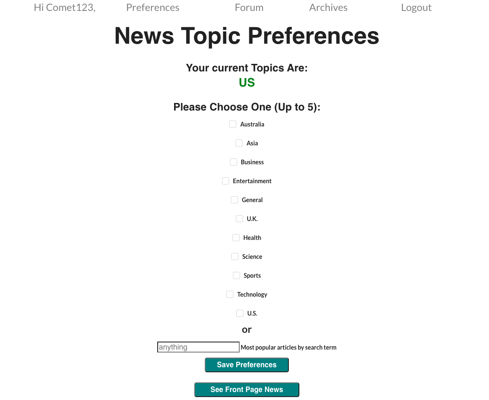

# news-aggregator-capstone2
The second Capstone project for Springboard involving a news aggregator app that allows a user to curate articles pertaining to preselected topics a user is interested in using the NewsAPI.org

This web app returns to users curated news articles according to user selected preferences/topics in a front page newspaper format. User can archive and also discuss these articles in a forum on the app. 

Features implemented include a user login/signup/logout to keep user settings private. A preferences select page that allows users to select news topics that they will be interested in reading. Then the user can save their articles in their user account and also post an interesting article for discussion in the forum. There is also a search term available in case none of the preselected topics interest the user. 

Tests are run using Cypress and the files are located in the src/ folder.

Upon sign in or register, the user is taken to the Preferences page where user can select predetermined topics about the news they would like to read. User can select up to five topics. They may also enter a search term. They can save these settings and/or change them by navigating back go this screen at any time. 

After the topics are selected, user clicks on show articles to see the returned frontpage. Here at the frontpage user can see the date, and the articles retrieved by the API. Within each article, user can "archive" or post article into a forum. 

The archive functionality allows users to save their articles in their profile to view at a later date since it will be in the database.

The forum functionality allows users to post their articles in an open forum for all users to comment and discuss. Each user can post comments about the article and receive likes for their comments. 

Finally there is a logout feature.

Tech Stack Used: Express.js, React.js, Axios, Bcrypt (for authentication), JWT-tokens (for authentication), PostgreSQL (for database), Cypress (for testing), CSS, HTML5

NOTES: 

Most articles returned to user have full metadata about the article, however some data can be missing in some cases where the page would render a blank for that section of the article.

The article in the frontpage is just the title, a brief article synopsis or description, the article image, and the author. It is not the full article itself. User must be aware that reading the article will REDIRECT to the url page AWAY from the web site. Once out of the website, user will be subjected to whatever the URL will serve them including cookie permissions, ads, banners, etc. The URL will show the article but note the above.

